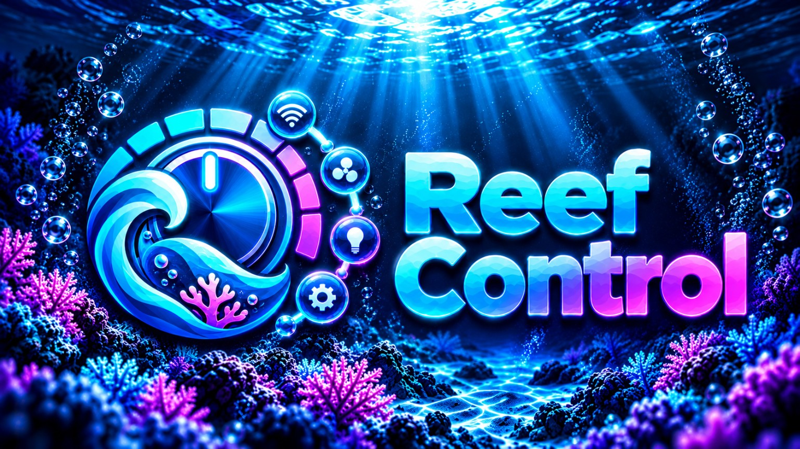

<p align="center">
  
</p>

# Reef Control

**Reef Control** is a custom Home Assistant integration for monitoring, coordinating and protecting a reef aquarium.

It brings aquarium equipment, water parameters, operating modes, safety logic, manual measurements and Reef ICP data together in one Home Assistant device, with an optional Lovelace card for a compact aquarium overview.

> Current integration version: **v0.12.1**  
> Current Reef Control card: **v0.1.11**

[](https://www.home-assistant.io/)
[](https://www.hacs.xyz/)
[](LICENSE)

---

## What Reef Control can do

Reef Control is intentionally **hardware-agnostic** for most aquarium equipment.

If a pump, heater, light, skimmer or other device already exists as a Home Assistant entity, Reef Control can assign that entity to an aquarium role and use it for monitoring, feeding mode, maintenance mode, safety logic and equipment dependencies.

### Aquarium setup

Each Reef Control aquarium stores:

- aquarium name
- net water volume
- aquarium type
- supply system
- reef method

This creates one Home Assistant device that groups the Reef Control entities for that aquarium.

---

## Equipment groups

Since **v0.12.1**, equipment is no longer limited to one device per role.

You can assign **one or multiple entities** to:

- return pumps
- protein skimmers
- flow / circulation pumps
- UV-C devices
- aquarium lights
- heaters
- ATO / top-off pumps
- calcium reactor components
- leak sensors

For example, a reef aquarium with two circulation pumps can simply use both:

```text
Flow pumps
├── switch.smartdrift_left
└── switch.smartdrift_right
```

The same principle also works for two heaters, multiple lights, redundant return pumps or multiple leak sensors.

### Redundant return pumps

If multiple return pumps are configured, Reef Control treats the return system as running as long as **at least one configured return pump is running**.

This is useful for systems using two pumps for redundancy.

---

## Improved configuration flow

The Reef Control configuration menu is designed as one configuration session.

You can open:

```text
Settings
└── Devices & services
    └── Reef Control
        └── Configure
```

Then move between areas such as:

- Equipment & entities
- Water values
- Monitoring limits
- Operating modes
- Temperature control
- Water level control
- UV-C control
- Equipment control
- Safety control
- Reef ICP

Changes are kept while navigating between pages.

Only **Save & close** finishes the configuration and reloads the integration once.

Monitoring-limit submenus also provide a **Back** entry instead of forcing you to reopen the configuration dialog.

---

# Water monitoring

Reef Control can use existing Home Assistant sensors for:

- temperature
- pH
- salinity
- conductivity
- redox / ORP
- water level

## Salinity

Salinity can be obtained in three ways:

- direct salinity sensor
- calculated from conductivity + temperature
- automatic selection

The calculated mode uses conductivity and temperature to calculate practical salinity using **PSS-78**.

Conductivity values in µS/cm and mS/cm are normalized internally.

---

## Monitoring limits

Individual normal and critical ranges can be configured for:

- temperature
- pH
- salinity
- redox / ORP

Reef Control then reports states such as:

```text
OK
Too low
Too high
Critical
Unavailable
```

The **Overall status** entity combines the configured water monitoring and Reef ICP state into a compact aquarium status.

---

# Manual water measurements

Reef Control provides editable number entities for manual measurements:

| Parameter | Unit |
|---|---|
| KH / Alkalinity | dKH |
| Calcium | mg/L |
| Magnesium | mg/L |
| Nitrate | mg/L |
| Phosphate | mg/L |

Every manual measurement stores the time of the last change and classifies its age as:

- fresh
- aging
- stale

This allows manually tested water values to remain useful without pretending that an old measurement is current.

---

# Reef ICP integration

Reef Control can link an aquarium to a configured **Reef ICP** aquarium.

Reef ICP project:

https://github.com/shdtfy/ha-oceamo-icp

When linked, Reef Control can use information from the latest ICP analysis, including:

- provider
- analysis date
- age of the analysis
- analysis status
- number of warnings / critical values
- affected elements
- measured water values

For KH, Calcium, Magnesium, Nitrate and Phosphate, Reef Control combines Reef ICP and manual measurements.

Current preference logic:

```text
current manual value
        ↓
current Reef ICP value
        ↓
older manual value
        ↓
older Reef ICP value
```

The selected source and source age are exposed as attributes.

---

# Feeding mode

Reef Control provides a **Feeding mode** switch.

You can configure which equipment groups should pause during feeding:

- skimmers
- return pumps
- flow pumps
- UV-C
- ATO
- calcium reactor components

The feeding duration is configurable.

A separate skimmer restart delay can keep the skimmer off for a few extra minutes after feeding mode ends.

### Example

A typical configuration could be:

```text
Feeding mode: 10 minutes

Flow pumps:        pause
Skimmer:           pause
ATO:               pause
Return pump:       keep running
UV-C:              keep running
Calcium reactor:   keep running
Skimmer restart:   +5 minutes
```

When feeding mode ends, Reef Control restores equipment that was running before the pause.

---

# Maintenance mode

The **Maintenance mode** switch can temporarily pause selected equipment while you work on the aquarium.

Available groups include:

- skimmers
- return pumps
- flow pumps
- UV-C
- ATO
- heaters
- lights
- calcium reactor components

Example:

```text
Maintenance ON
├── Return pumps OFF
├── Flow pumps OFF
├── Skimmer OFF
├── ATO OFF
├── Heater OFF
└── Light stays ON
```

When maintenance mode is turned off, Reef Control restores the previous equipment states and re-evaluates automatic controllers such as temperature control and ATO.

---

# Temperature control

Reef Control includes an optional automatic heater controller.

It supports:

- one or multiple heaters
- one primary temperature sensor
- configurable target temperature
- hysteresis
- minimum heater ON time
- minimum heater OFF time
- pause during maintenance
- high-temperature safety shutdown
- sensor-failure safety shutdown

### Example

```text
Target:       25.0 °C
Hysteresis:    0.3 °C

≤ 24.7 °C  → heaters ON
≥ 25.0 °C  → heaters OFF
```

If multiple heaters are selected, Reef Control controls them as one heater group.

The water sensor intentionally remains a **single primary sensor**, because automatic control needs one clearly defined reference value.

---

# Automatic top-off / ATO

Reef Control includes an automatic water-level controller.

Supported features:

- binary float / optical sensors
- numeric water-level sensors
- one or multiple ATO pumps
- low-level confirmation delay
- maximum pump runtime
- cooldown between fill cycles
- automatic pause during feeding / maintenance
- safety lock after maximum runtime
- daily ATO statistics

The ATO statistics include information such as:

- fills today
- runtime today
- current fill duration
- last fill start
- last fill stop
- last fill duration

### ATO safety lock

If the configured maximum runtime is exceeded, Reef Control stops the ATO and locks it.

The lock can only be reset when the unsafe condition is gone.

---

# Equipment dependency control

Reef Control can use the **return pump group as a master condition** for dependent aquarium equipment.

Optional dependencies:

- skimmer depends on return pump
- UV-C depends on return pump
- ATO depends on return pump
- flow pumps depend on return pump

Different restart delays can be configured.

### Example

```text
Return pump stops
        │
        ├── Skimmer OFF
        ├── UV-C OFF
        └── ATO blocked

Return pump starts again
        │
        ├── UV-C after 1 min
        └── Skimmer after 5 min
```

Only equipment that Reef Control itself paused is automatically restarted.

---

# UV-C control

Reef Control can control one or multiple UV-C entities.

Modes:

- Continuous
- Schedule
- Off

Schedules can also cross midnight.

UV-C control respects:

- feeding mode
- maintenance mode
- configured return-pump dependency

---

# Safety control

Reef Control contains central aquarium safety interlocks.

## Leak protection

One or multiple leak sensors can be assigned.

If any configured leak sensor reports the configured alarm state, Reef Control can perform a latched emergency shutdown.

Selectable shutdown targets include:

- return pumps
- skimmers
- UV-C
- ATO
- heaters

The leak alarm remains latched after the sensor becomes dry again. This prevents equipment from silently restarting after a real leak.

## Temperature safety

Reef Control can:

- stop all configured heaters at critical high temperature
- stop all configured heaters if the primary temperature sensor becomes unavailable or invalid

Safety logic has priority over normal equipment operation.

---

# Alarm system

Reef Control maintains active aquarium alarms and an alarm history.

It also fires Home Assistant events:

```text
reef_control_alarm
reef_control_alarm_cleared
```

These can be used in automations.

### Example: mobile notification

```yaml
alias: Reef Control Alarm
triggers:
  - trigger: event
    event_type: reef_control_alarm

actions:
  - action: notify.mobile_app_your_phone
    data:
      title: "Reef Control"
      message: >
        {{ trigger.event.data.message }}
```

Replace `notify.mobile_app_your_phone` with your own Home Assistant notify service.

---

# Alarm reset

Reef Control provides an **Alarm reset** button.

It can reset latched:

- leak protection
- ATO maximum-runtime safety lock

A reset is refused while the unsafe condition still exists.

Examples:

```text
Leak sensor still wet
→ reset blocked

ATO water level still low
→ reset blocked

Cause removed
→ reset allowed
```

---

# Calcium reactor support

Calcium reactor equipment can be assigned as a separate multi-entity group.

For example:

```text
Calcium reactor
├── circulation pump
├── feed pump
└── CO₂ solenoid
```

The group can currently participate in:

- feeding mode
- maintenance mode
- dashboard equipment display

### Not implemented yet

Reef Control does **not yet** provide dedicated calcium-reactor pH / CO₂ regulation.

The current implementation is equipment grouping and operating-mode handling only.

---

# Reef Control dashboard card

The integration includes the custom **Reef Control Card**.

It displays a compact overview of the aquarium, including:

- overall status
- current operating mode
- temperature
- salinity
- pH
- redox
- conductivity
- water level
- active warnings
- Reef ICP information
- KH / Calcium / Magnesium / Nitrate / Phosphate
- feeding and maintenance quick actions
- configured equipment states
- multiple devices per equipment group
- calcium reactor group

The JavaScript resource is automatically registered when Home Assistant uses Lovelace storage mode.

### Example card

```yaml
type: custom:reef-control-card
entity: sensor.your_aquarium_aquarium
```

Replace the entity with the **Aquarium** sensor created by your Reef Control instance.

If an updated card is not immediately visible after upgrading, restart Home Assistant and perform a browser/app refresh.

---

# Entity overview

A Reef Control aquarium currently creates the following types of entities.

## Sensors

- Aquarium
- Operating status
- Temperature control status
- Remaining time
- Temperature
- pH
- Salinity
- Redox
- Conductivity
- Reef ICP connection
- ICP status
- Water values
- Overall status
- Active alarms
- ATO statistics
- Water level

## Switches

- Feeding mode
- Maintenance mode
- Temperature control
- Water level control / ATO

## Numbers

Manual measurements:

- KH
- Calcium
- Magnesium
- Nitrate
- Phosphate

TC420 / SIMU-LUX setpoints:

- Light channel 1
- Light channel 2
- Light channel 3
- Light channel 4

## Binary sensors

- Safety alarm
- Equipment interlock
- Leak alarm
- TC420 bridge

## Buttons

- Alarm reset

---

# Example setup: mixed reef

A medium-size mixed reef could be configured like this:

```text
Reef Control: Living Room Reef

Water sensors
├── Temperature
├── pH
├── Conductivity
└── Redox

Equipment
├── Return pump
│   └── DC return pump
├── Flow pumps
│   ├── Left circulation pump
│   └── Right circulation pump
├── Skimmer
├── Heater
├── ATO pump
├── Aquarium light
└── Leak sensors
    ├── Sump leak sensor
    └── Cabinet leak sensor
```

Possible behavior:

```text
Feeding
→ both flow pumps OFF
→ skimmer OFF
→ ATO paused
→ skimmer starts again 5 minutes later

Maintenance
→ return pump OFF
→ both flow pumps OFF
→ skimmer OFF
→ heater OFF
→ ATO OFF

Leak
→ return pump OFF
→ skimmer OFF
→ heater OFF
→ ATO OFF
→ alarm stays latched until manually reset
```

---

# TC420 / LEDaquaristik SIMU-LUX

The repository also contains the experimental `reef_control_tc420` Home Assistant app for USB communication with compatible TC420 / SIMU-LUX controllers using USB ID:

```text
0888:4000
```

The Reef Control integration currently exposes:

- four SEA WATER channel setpoints
- 0–100 % sliders
- TC420 bridge connectivity diagnostics
- channel 5 fixed at 0 % in the bridge implementation
- no physical output readback

## Important status

USB communication and the Home Assistant → Reef Control → bridge command path have been demonstrated.

However, **stable physical live dimming is not considered production-ready yet** on the tested SIMU-LUX/TC420 setup.

The controller can continue following its internally stored day program while repeated USB fast-play packets only disturb the outputs briefly. For that reason, the current TC420 bridge should be treated as **experimental**.

Stored TC420 lighting programs are not intentionally modified by the current live bridge.

A future direction is to let Reef Control program an internal TC420 schedule and then allow the controller to run autonomously without permanent USB traffic.

---

# Installation

## HACS custom repository

1. Open **HACS**
2. Open **Integrations**
3. Add a **Custom repository**
4. Use:

```text
https://github.com/shdtfy/ha-reef-control
```

5. Select repository type **Integration**
6. Install **Reef Control**
7. Restart Home Assistant
8. Go to **Settings → Devices & services**
9. Select **Add integration**
10. Search for **Reef Control**

Minimum Home Assistant version declared by the repository:

```text
2025.1.0
```

---

## Manual installation

Copy:

```text
custom_components/reef_control/
```

to:

```text
/config/custom_components/reef_control/
```

Restart Home Assistant and add **Reef Control** from **Settings → Devices & services**.

---

# Updating

After replacing integration files:

1. restart Home Assistant
2. verify the version shown on the Reef Control device
3. open **Configure**
4. check equipment assignments
5. use **Save & close**

For card changes, a frontend refresh may also be required.

---

# Compatibility and design notes

- Equipment control is based on existing Home Assistant entities.
- Water-value controllers use one explicit primary sensor per parameter.
- Multiple devices are supported for equipment groups.
- Old single-entity Reef Control options are kept for backwards compatibility.
- Multiple return pumps are treated as a redundant return group.
- Safety actions only target configured equipment.
- Vendor-specific cloud integrations are not bundled into Reef Control.
- Reef Control does not require every aquarium device to be connected through a switch if that device already exposes a controllable Home Assistant entity.

---

# Project status

Reef Control is under active development.

Current focus areas include:

- broader equipment support
- improved aquarium automation
- better local hardware control
- pump integrations and flow modes
- lighting schedules
- expanded calcium reactor support
- additional safety logic
- further Reef ICP integration

Bug reports, ideas and testing feedback are welcome through the GitHub issue tracker.

---

# License

Reef Control is released under the [MIT License](LICENSE).

Repository:

https://github.com/shdtfy/ha-reef-control
